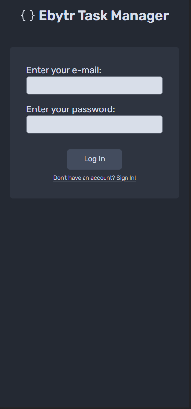
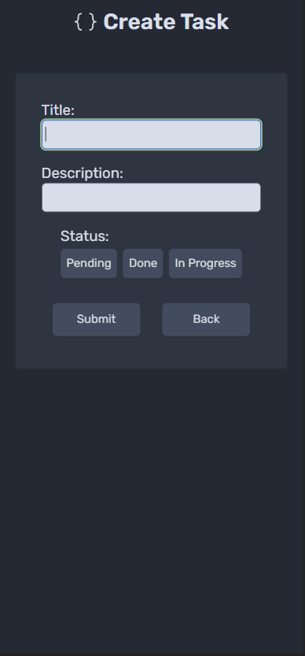
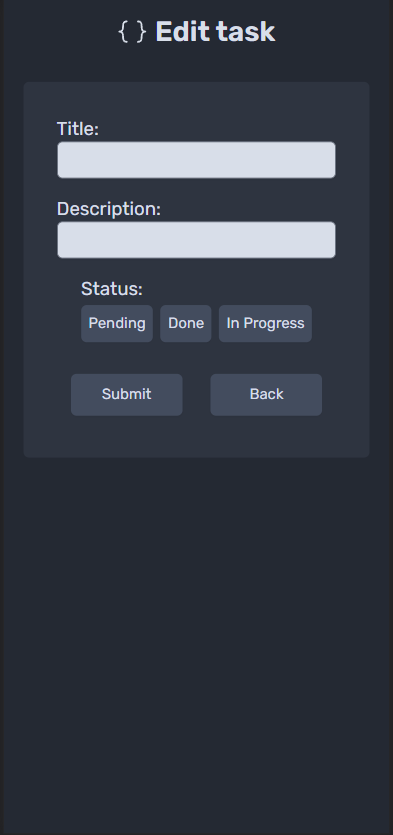
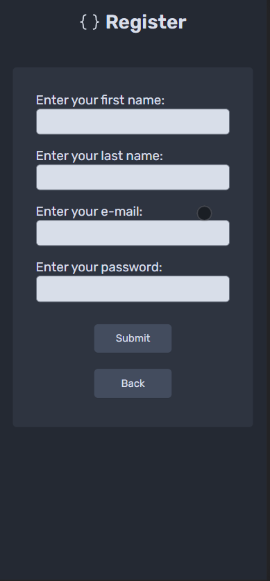
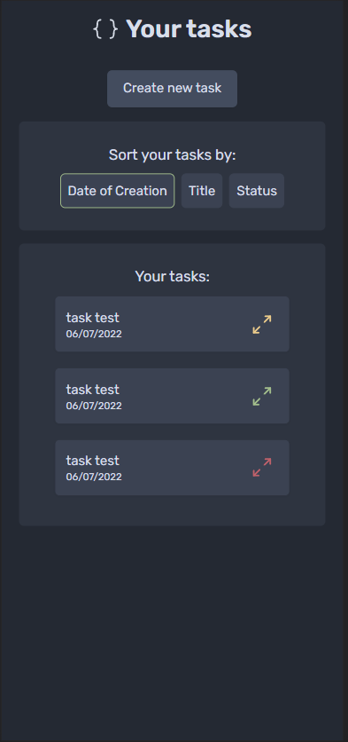

# Ebytr Todo-List

Fullstack project developed to allow the user to create an account, and once logged in, is capable of creating, editing, and deleting tasks in a to-do list template

## Table of contents

- [General view](#general-view)
  - [The Challenge](#the-challenge)
  - [Images](#images)
  - [Links](#links)
- [The development process](#the-development-process)
  - [Tools used](#tools-used)
  - [Lessons learned](#lessons-learned)
- [Usage](#usage)
- [Testing](#testing)
- [TroubleShooting](#troubleshooting)
- [Author](#author)

## General view

### The challenge

Ebytr To-Do list is a project that creates a task list, where a user can create and log in in their account, and manipulate their tasks.

**The users must be capable of**

- Register and authenticate themselves
- Create tasks
- Sort tasks by title, date of creation, and status
- Update tasks
- Delete tasks

## Images

<div align="center">
  
  
  
</div>

<div align="center">
  
  
</div>

## The development process

### Tools used

#### Front-end

- TypeScript
- React _(Vite)_
- Axios
- React-hook-form
- Redux _(Redux Toolkit)_
- TailWind CSS
- Headless UI
- Axios
- HTTP-Status-Codes
- Phosphor-react
- React Testing Library

#### Back-end

- TypeScript
- Node.js
- Express.js
- BCryptJS
- cors
- express-async-errors
- Joi
- Jest
- JWT
- Prisma
- MySQL

### Lessons learned

In this project I could improve my knowledge in both front-end and back-end, by:

- Using and learning about new libraries and frameworks and its applicabilities.
- Using docker and docker-compose to create two separate environments, one for development, and one for testing.
- Creating a fake database to make end to end tests.
- Fetching the backend using Redux toolkit async actions.

## Usage

### Docker

```bash
git clone git@github.com:adrancarnavale/ebytr-fullstack-project.git
```

```bash
cd ebytr-fullstack-project
```

- You will have access to various scripts, that will help you achieving what you want to do.
  - To enter in the development environment, run:
    ```bash
    yarn compose:up:dev
    ```
  - To exit from the development environment, run:
    ```bash
    yarn compose:down:dev
    ```
  - To enter in the test environment, run:
    ```bash
    yarn compose:up:test
    ```
  - To exit from the test environment, run:
    ```bash
    yarn compose:down:test
    ```
- If having any problems to compose your containers, please, refer to the [Troubleshooting](#troubleshooting)

## Testing

### Front-end

- **Please certificate that you are in the test environment. If not, please change it first following the corresponding commands found in the section [Usage](#usage)**

- Navigate to the Front-end directory

```bash
cd frontend
```

```bash
yarn test
```

### Back-end

- **Please certificate that you are in the test environment. If not, please change it first following the corresponding commands found in the section [Usage](#usage)**

- Navigate to the Back-end directory

```bash
cd backend
```

```bash
yarn test
```

## Troubleshooting

- Error:
  ```bash
  > [ebytrtodolist_backend_test internal] load metadata for docker.io/library/node:16-alpine:
  failed to solve: rpc error: code = Unknown desc = failed to solve with frontend dockerfile.v0: failed to create LLB definition: rpc error: code = Unknown desc = error getting credentials - err: exit status 255, out: ``
  error Command failed with exit code 17.
  ```
- Solution:
  - Run the command:
  ```bash
  yarn docker:repair
  ```

## Author

- LinkedIn - [Ádran Carnavale](https://www.linkedin.com/in/adrancarnavale/)
